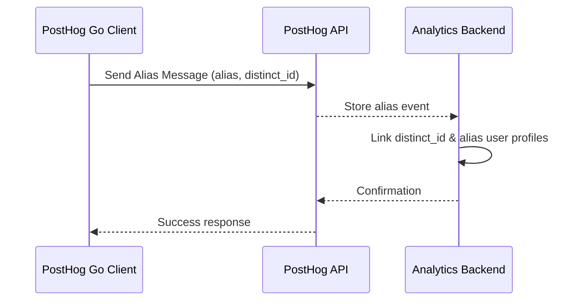

# Aliases & Context Linking

## Overview

In analytics workflows, it is common for a user to interact with a system under multiple identities—such as initially as an anonymous visitor and later as a logged-in user. The Aliases & Context Linking functionality provides a way to merge these different user identities, ensuring their actions are unified under a single user profile. This process, often referred to as aliasing, creates explicit connections between user contexts, enabling accurate tracking, reporting, and targeting.

This page documents how to use the PostHog Go client to set up and manage user aliases, outlining the lifecycle and impact of aliasing on user data and analytics.

---

## Why Alias Users?

Aliasing bridges the gap between multiple distinct user IDs that represent the same person, such as:

- A user browsing your site anonymously (`distinct_id = anonymous123`)
- The same user signing up or logging in (`distinct_id = user456`)

By linking these IDs, you consolidate event histories, feature flag assignments, and traits under a single unified identity. This results in:

- **Seamless analytics** representing the true user journey.
- **Consistent feature flag and experiment targeting**.
- **Reliable user profile data** for segmentation and personalization.

---

## How Aliasing Works in PostHog Go

The PostHog Go client provides a specific message type called `Alias` designed to create these links programmatically. An alias associates an existing user identifier (`DistinctId`) with an alternate identifier (`Alias`). When submitted, the analytics backend merges the event streams tied to these IDs.

### Key Properties

| Property      | Description                                              | Required       |
| ------------- | -------------------------------------------------------- | -------------- |
| `Alias`       | The new identity you want to link to an existing user ID | Yes            |
| `DistinctId`  | The current user identifier that will be aliased         | Yes            |
| `Timestamp`   | Optional timestamp for aliasing event                     | Optional       |
| `DisableGeoIP`| Optionally disable GeoIP lookup for privacy compliance   | Optional       |

---

## Performing an Alias Call

The typical workflow to perform aliasing is:

1. **Identify the Old User ID**: The `DistinctId` tied to the current anonymous or unregistered user context.
2. **Reference the New User ID**: The authenticated or permanent ID that should represent the user.
3. **Send the Alias Call**: Using the `Alias` type through the client, you send the linking event.

### Alias Message Construction Example in Go

```go
import (
	"time"
	"github.com/PostHog/posthog-go"
)

func createAlias(client posthog.Client, oldId, newId string) error {
	aliasMsg := posthog.Alias{
		Alias:      newId,
		DistinctId: oldId,
		Timestamp:  time.Now(),
	}

	// Validate fields before sending
	if err := aliasMsg.Validate(); err != nil {
		return err
	}

	// Send alias message
	return client.Enqueue(aliasMsg)
}
```

### What Happens Under the Hood

When the alias message is sent, it is transformed into the appropriate API payload automatically:

```json
{
  "type": "alias",
  "event": "$create_alias",
  "timestamp": "2009-11-10T23:00:00Z",
  "library": "posthog-go",
  "library_version": "1.0.0",
  "properties": {
    "distinct_id": "B",
    "alias": "A",
    "$lib": "posthog-go",
    "$lib_version": "1.0.0"
  }
}
```

This payload signals the backend to merge the user histories.

---

## Best Practices & Recommendations

- **Alias Early**: Trigger aliases as soon as the user authenticates or registers to avoid inconsistent data under separate IDs.
- **Unique Identifiers**: Ensure that both your `Alias` and `DistinctId` values are stable, unique, and consistently scoped.
- **Timing Matters**: Use a meaningful `Timestamp` to preserve the event sequence correctly.
- **GeoIP Considerations**: Use `DisableGeoIP` if the aliasing event should not include geolocation data, respecting user privacy or compliance.

---

## Troubleshooting Alias Issues

<AccordionGroup title="Common Problems and Solutions">
<Accordion title="Alias Call Not Linking Users">
Check that:
- Both `DistinctId` and `Alias` are non-empty and valid strings.
- The alias event is correctly sent and received by the PostHog server.
- Events have timestamps in the correct order to ensure proper merging.
</Accordion>
<Accordion title="Duplicate User Profiles Persist">
- Make sure aliasing occurs immediately when the user identity changes.
- Confirm no conflicting IDs are in use elsewhere.
- Review backend settings on user merging; sometimes custom setups might affect alias behavior.
</Accordion>
<Accordion title="GeoIP is Incorrect or Unneeded">
Use the `DisableGeoIP` flag to disable location lookups during alias calls when data privacy concerns apply.
</Accordion>
</AccordionGroup>

---

## Related Concepts

- **User Identification & Merging:** After aliasing, use `Identify` calls to update user traits and ensure the unified profile stays current.
- **Feature Flags:** Aliasing impacts which features a user sees by unifying evaluation contexts.
- **Event Capture:** All events associated with any linked IDs are aggregated under the unified identity.

[Learn more about identifying users here](/api-reference/core-entities/identify-users).

---

## Alias Lifecycle Diagram



---

## Additional Resources

- [What is PostHog Go?](/overview/introduction-and-value/what-is-posthog-go) - Understand the client basics
- [User Identification & Aliasing Guide](/guides/core-workflows/user-identification-aliasing) - User journeys and aliasing context
- [Event Capture Reference](/api-reference/core-entities/capture-events) - Capturing user events correctly

<Check>
Make sure your client is initialized correctly and authenticated before sending alias messages.
</Check>

---

For complete source reference, see [alias.go on GitHub](https://github.com/PostHog/posthog-go/blob/main/alias.go).

---
