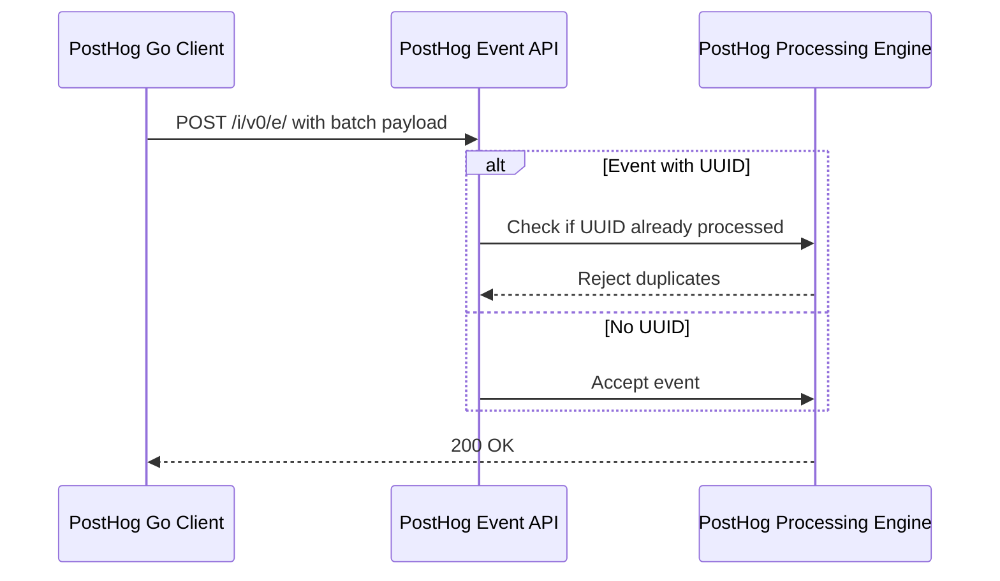

# Event Capture API Reference

Capture tailored user interactions by sending custom events to the PostHog analytics platform using the PostHog Go client. This documentation details how to properly construct event capture requests, configure event properties, handle batching, and employ UUIDs to deduplicate events—empowering you to extract precise behavioral insights from your Go applications.

---

## 1. Overview of Event Capture

The Event Capture API allows you to record discrete user actions or system events that matter most to your product analytics. Whether you want to track a user login, button click, file download, or a background task completion, this endpoint provides flexibility and control.

Your objective is to reliably submit structured event data that maps to meaningful user behaviors and system states for robust analytics.

### Key Value Propositions

- **Flexible event naming:** Define your event names to match business terminology.
- **Rich property mapping:** Attach any contextual metadata as properties to enhance event value.
- **Timestamp precision:** Customize event occurrence time for accurate analytics timelines.
- **Batch support:** Optimize network efficiency by sending multiple events in a single payload.
- **Deduplication via UUID:** Avoid double counting with unique event identifiers.

---

## 2. Capturing a Single Event

To capture an individual event, send a POST request with a single event object inside a `batch` array containing:

- `distinct_id`: The unique identifier for the user or entity performing the event.
- `event`: The event name string, e.g., "Download".
- `library` and `library_version`: Identifies the PostHog client library used (e.g., "posthog-go", "1.0.0").
- `properties`: A key-value map of event properties.
- `timestamp`: (Optional) ISO 8601-formatted timestamp for when the event happened.
- `uuid`: (Optional) A unique identifier to deduplicate events.
- `send_feature_flags`: (Optional) Whether to attach current feature flags.
- `type`: Always set to "capture" for events.

### Example: Single Event Capture Without UUID

```json
{
  "api_key": "Csyjlnlun3OzyNJAafdlv",
  "batch": [
    {
      "distinct_id": "123456",
      "event": "Download",
      "library": "posthog-go",
      "library_version": "1.0.0",
      "properties": {
        "$geoip_disable": true,
        "$lib": "posthog-go",
        "$lib_version": "1.0.0",
        "application": "PostHog Go",
        "platform": "macos",
        "version": "1.0.0"
      },
      "send_feature_flags": false,
      "timestamp": "2009-11-10T23:00:00Z",
      "type": "capture",
      "uuid": ""
    }
  ]
}
```

### Example: Single Event Capture With UUID for Deduplication

Including a UUID ensures that if the same event is sent multiple times, PostHog treats it as one unique event.

```json
{
  "api_key": "Csyjlnlun3OzyNJAafdlv",
  "batch": [
    {
      "distinct_id": "123456",
      "event": "Download",
      "library": "posthog-go",
      "library_version": "1.0.0",
      "properties": {
        "$geoip_disable": true,
        "$lib": "posthog-go",
        "$lib_version": "1.0.0",
        "application": "PostHog Go",
        "platform": "macos",
        "version": "1.0.0"
      },
      "send_feature_flags": false,
      "timestamp": "2009-11-10T23:00:00Z",
      "type": "capture",
      "uuid": "11111111-1111-1111-1111-111111111111"
    }
  ]
}
```

---

## 3. Batching Multiple Events

PostHog Go supports sending multiple event capture requests in a single batch. This dramatically reduces network overhead and improves throughput when tracking many events rapidly.

### Guidelines for Batching

- The payload includes an array named `batch`, which contains one or more event objects.
- Each event object within the batch follows the same schema as described for single event capture.
- You can mix event properties to reflect different contexts, timestamps, or distinct users.

### Example: Batch of Multiple Events

```json
{
  "api_key": "Csyjlnlun3OzyNJAafdlv",
  "batch": [
    {
      "distinct_id": "123456",
      "event": "Download",
      "library": "posthog-go",
      "library_version": "1.0.0",
      "properties": {
        "$geoip_disable": true,
        "$lib": "posthog-go",
        "$lib_version": "1.0.0",
        "application": "PostHog Go",
        "version": 0
      },
      "send_feature_flags": false,
      "timestamp": "2009-11-10T23:00:00Z",
      "type": "capture",
      "uuid": ""
    },
    {
      "distinct_id": "123456",
      "event": "Download",
      "library": "posthog-go",
      "library_version": "1.0.0",
      "properties": {
        "$geoip_disable": true,
        "$lib": "posthog-go",
        "$lib_version": "1.0.0",
        "application": "PostHog Go",
        "version": 1
      },
      "send_feature_flags": false,
      "timestamp": "2009-11-10T23:00:00Z",
      "type": "capture",
      "uuid": ""
    },
    {
      "distinct_id": "123456",
      "event": "Download",
      "library": "posthog-go",
      "library_version": "1.0.0",
      "properties": {
        "$geoip_disable": true,
        "$lib": "posthog-go",
        "$lib_version": "1.0.0",
        "application": "PostHog Go",
        "version": 2
      },
      "send_feature_flags": false,
      "timestamp": "2009-11-10T23:00:00Z",
      "type": "capture",
      "uuid": ""
    }
  ]
}
```

---

## 4. Event Properties

Event properties enrich your captured data with context to uncover deeper analytics.

### Required and Recommended Properties

| Property         | Description                                                                   | Example                    |
|------------------|-------------------------------------------------------------------------------|----------------------------|
| `$lib`           | The PostHog client library name (auto-assigned).                            | "posthog-go"             |
| `$lib_version`   | Client library version (auto-assigned).                                      | "1.0.0"                  |
| `$geoip_disable` | Boolean flag to disable GeoIP lookup (e.g., for privacy or compliance).      | true                       |
| `application`    | Your application name, useful in multi-app setups.                           | "PostHog Go"             |
| `platform`       | OS or environment identifier (optional).                                    | "macos"                  |
| `version`        | Application or API versioning number or string.                             | "1.0.0" or 0             |

### Custom Properties

You may add any additional key-value pairs representing your domain-specific data. Property keys should be descriptive and consistent across events.

<Note>
Avoid using properties beginning with `$` besides those documented; they may have reserved significance.
</Note>

---

## 5. Handling Event Timestamp

By default, events are timestamped with the server receive time if the `timestamp` field is omitted. To capture the exact time an event occurred, include the ISO 8601 timestamp in the `timestamp` field.

### Valid Format

- ISO 8601 format string, e.g., `"2015-07-10T23:00:00Z"`

### Example

```json
"timestamp": "2015-07-10T23:00:00Z"
```

Accurately timestamped events empower time-based analytics and trend visualization.

---

## 6. UUID for Event Deduplication

When tracking the same event from distributed systems or retrying failed requests, it’s critical to avoid duplicate analytics.

### How UUID Deduplication Works

- Provide a UUID string to the `uuid` field in the event object.
- PostHog uses this UUID to identify and discard duplicate events received multiple times.

### UUID Format

- A valid UUID, e.g., `"11111111-1111-1111-1111-111111111111"`

### Best Practices

- Generate UUIDs client-side before sending to ensure uniqueness.
- Use UUIDs especially for critical or server-side events prone to retries.

### Example

```json
"uuid": "11111111-1111-1111-1111-111111111111"
```

---

## 7. Advanced Usage: Combining Features

You can combine batching, timestamps, properties, and UUIDs seamlessly within one API call to capture versatile event data streams efficiently.

Below is an example combining these features:

```json
{
  "api_key": "Csyjlnlun3OzyNJAafdlv",
  "batch": [
    {
      "distinct_id": "123456",
      "event": "Download",
      "library": "posthog-go",
      "library_version": "1.0.0",
      "properties": {
        "$geoip_disable": true,
        "$lib": "posthog-go",
        "$lib_version": "1.0.0",
        "application": "PostHog Go",
        "platform": "macos",
        "service": "api",
        "version": "1.0.0"
      },
      "send_feature_flags": false,
      "timestamp": "2015-07-10T23:00:00Z",
      "type": "capture",
      "uuid": ""
    }
  ]
}
```

---

## 8. Common Pitfalls and Troubleshooting

<Warning>
- Ensure the `distinct_id` is consistently set and uniquely identifies a user or entity.
- Missing or malformed timestamps can lead to misaligned analytics.
- Omitting `uuid` on retryable events may cause duplicate counts.
- Overloading properties with large or sensitive data can degrade performance or violate privacy.
</Warning>

<Check>
- Double-check the API key correctness for authorization.
- Use the correct ISO 8601 format for timestamps.
- Validate your JSON structure before sending.
- Verify batch size to avoid exceeding payload limits.
</Check>

---

## 9. Integration Workflow Diagram



---

## 10. Next Steps

After mastering event capture, explore:

- [User & Group Identification](/api-reference/core-entities/identify-users) to know who generated events
- [Event Deduplication with UUIDs](/guides/advanced-use-cases/event-deduplication-uuid) for robust analytics
- [Batching & Performance Optimization](/guides/advanced-use-cases/performance-optimization) for scaling

---

For context on how event capture ties with other core functionalities, see [Integrating with the PostHog Platform](/overview/features-and-integration/integration-with-posthog).

---