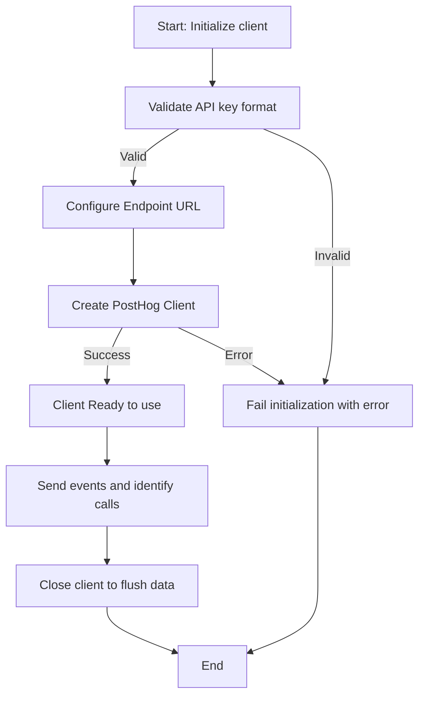

# Client Initialization & Authentication

Welcome to the foundational step for integrating PostHog Go into your backend applications. This guide takes you through the process of instantiating the PostHog Go client, configuring connection endpoints, securely authenticating with API keys, and managing the client's lifecycle. Whether you're setting up for your first event capture or preparing to evaluate feature flags, these steps ensure your setup is robust, secure, and optimally configured.

---

## 1. Why Client Initialization & Authentication Matter

Before your application can send events, identify users, or evaluate feature flags with PostHog, you need a properly initialized client instance. This client acts as your gateway, managing secured communication with the PostHog platform and enabling you to realize backend-driven analytics and experimentation.

Improper initialization or misconfigured authentication risks losing valuable data, exposing security credentials, or causing integration failures.

This documentation helps you avoid those pitfalls by focusing on:

- How to instantiate the PostHog Go client clearly and correctly
- How to configure endpoint URLs based on your environment
- How to authenticate securely using your project and personal API keys
- Best practices for client lifecycle and error handling

---

## 2. Instantiating the PostHog Go Client

### Basic Initialization Example

To create a new PostHog client instance, use the `posthog.New` method. The key parameters are your PostHog project API key and configuration options such as endpoint URL.

```go
import (
	"github.com/posthog/posthog-go"
)

func initializeClient() (posthog.Client, error) {
	client, err := posthog.New("phc_your_project_api_key", &posthog.Config{
		Endpoint: "https://app.posthog.com", // or your self-hosted URL
	})
	if err != nil {
		return nil, err
	}
	return client, nil
}
```

### Explanation

- **API Key**: Your project API key (prefixed by `phc_`), found on your PostHog setup page.
- **Config.Endpoint**: Defines the destination where the client sends data. Never expose this publicly if using a custom or self-hosted instance.

### Environment Variable Usage

It's a best practice to store your API keys and endpoints in environment variables or a `.env` file, which your application reads at runtime. This keeps credentials secure and easily configurable.

Example `.env` snippet:

```bash
POSTHOG_PROJECT_API_KEY=phc_your_project_api_key_here
POSTHOG_ENDPOINT=https://app.posthog.com
```

Load these in Go using libraries like `godotenv` for a seamless developer experience.

---

## 3. Authentication: Project & Personal API Keys

### Types of API Keys

- **Project API Key (`phc_` prefix):** Used for sending event data and performing actions scoped to your project.
- **Personal API Key (`phx_` prefix):** Used for advanced features like local evaluation of feature flags or managing PostHog remotely via API.

### Securing Your Keys

Keep both keys confidential. Never hardcode these keys in your source code or commit them to public repositories.

Always use environment variables or secret managers to handle sensitive credentials.

### How Authentication Works

When you initialize the client with your API key, it attaches this key to every request to PostHog’s ingestion endpoints.

If authentication fails due to an invalid or revoked key, the client will surface error responses when attempting to send data or retrieve features. Ensure keys are valid and have appropriate permissions.

---

## 4. Endpoint Configuration

### Default Endpoint

By default, the PostHog Go client points to `https://app.posthog.com`, which is the SaaS-hosted PostHog platform. For most users, no custom configuration is needed.

### Custom Endpoints

If you use a self-hosted PostHog instance or a proxy, configure the client to point to the correct URL:

```go
client, err := posthog.New(apiKey, &posthog.Config{
	Endpoint: "http://localhost:8000",
})
```

Ensure the endpoint string includes the scheme (`http://` or `https://`).

---

## 5. Managing Client Lifecycle

After initialization, it's crucial to manage the client’s lifecycle to maintain resource efficiency and data reliability.

### Closing the Client

When your application no longer needs to track events or is terminating, call `client.Close()` to flush any buffered events and release resources.

Example:

```go
err := client.Close()
if err != nil {
	// Handle error - client might have failed to send some events
}
```

Neglecting to close the client may result in lost event data.

---

## 6. Best Practices for Secure and Effective Initialization

- **Use environment variables for credentials** to avoid accidental exposure.
- **Validate API keys** before launching production deployments.
- **Configure endpoints explicitly** if using self-hosted or proxy setups.
- **Close the client gracefully** during application shutdown to prevent data loss.
- **Monitor client errors** returned during initialization and sending events to catch authentication or network issues early.
- **Limit use of personal API keys** to scenarios requiring advanced features such as local feature flag evaluation.

---

## 7. Troubleshooting Common Initialization Issues

<AccordionGroup title="Troubleshooting Client Initialization">
<Accordion title="Client Fails to Initialize with Error">
Ensure your API key is correct and has not been revoked. Verify network connectivity to your configured endpoint. Confirm the endpoint URL is correctly formatted with scheme.
</Accordion>
<Accordion title="Events Do Not Appear in PostHog">
Check whether the client was closed properly to flush buffered events. Confirm the project API key is for the correct PostHog project. Validate timestamps and payload data.
</Accordion>
<Accordion title="Authentication Errors in Logs">
Verify your API key’s permissions and expiration status. Rotate keys as needed. Avoid sharing keys accidentally through version control.
</Accordion>
</AccordionGroup>

---

## 8. Summary Diagram: Client Initialization & Authentication Flow



This flow represents how your PostHog Go client becomes operational after validation and setup, continuing through event capture and proper termination.

---

## 9. Additional Resources

- [What is PostHog Go?](https://posthog.com/docs/api-reference/core-entities/client-initialization-auth) - Overview of the library’s features
- [Integrating with the PostHog platform](https://posthog.com/docs/overview/features-and-integration/integration-with-posthog) - Configuring API keys and endpoints
- [.env Example for Configuration](https://github.com/PostHog/posthog-go/blob/main/examples/.env.example) - Sample environment variables setup
- [Best practices for Handling API Keys](https://posthog.com/docs/security)

---

## 10. Next Steps

Once your client is instantiated and authenticated:

1. Explore capturing events with the [Event Capture](https://posthog.com/docs/api-reference/core-entities/capture-events) documentation.
2. Set up user identification and aliasing via the [User & Group Identification](https://posthog.com/docs/api-reference/core-entities/identify-users) guide.
3. Dive into [Feature Flags & Remote Config](https://posthog.com/docs/api-reference/core-entities/feature-flags) to leverage experimentation.

This foundational page ensures you start your PostHog Go journey securely and efficiently, setting the stage for powerful analytics and experimentation.
