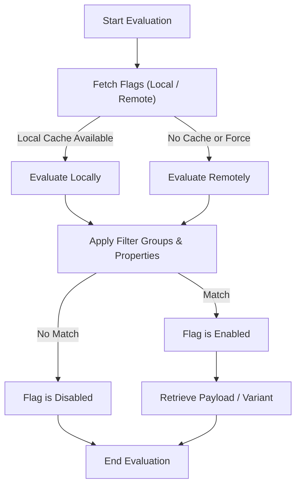

# Feature Flags & Remote Config

Welcome to the definitive guide on managing feature flags and remote configuration via the PostHog Go client. This section empowers you to check the status of feature flags, evaluate their payloads, work with multivariate flags, and retrieve remote configuration values—all in practical, production-ready ways.

The focus here is to help you seamlessly roll out features, segment users, and fine-tune your application's behavior remotely, maximizing impact while minimizing risk.

---

## Understanding Feature Flags

Feature flags allow you to enable, disable, or tweak features on the fly without deploying new code. PostHog Go exposes a clear, easy-to-use API to evaluate the status and payload of these flags for any given user.

### Key Concepts

- **Flag Activation:** Determines if a feature flag is enabled or disabled for the current context.
- **Flag Payload:** Additional data or configuration that the flag can deliver when enabled.
- **Multivariate Flags:** Flags that offer multiple variants beyond simple on/off.
- **Local vs. Remote Evaluation:** Flags can be evaluated locally from cached definitions or remotely via server calls.


## Checking Feature Flag Status

### Evaluate a Single Flag

To check whether a specific feature flag is enabled for a user, use the client's `IsFeatureEnabled` method, passing the flag key and user context.

```go
enabled := client.IsFeatureEnabled("beta-feature", user)
if enabled {
    // Enable beta feature behavior
} else {
    // Fallback to default functionality
}
```

This returns a boolean indicating if the flag is active for that user.

### Retrieve Flag Payloads

Some flags include a payload — structured data you can use to modify behavior dynamically.

```go
payload, err := client.GetFeatureFlagPayload("enabled-flag", user)
if err == nil {
    fmt.Printf("Payload: %s", payload) // JSON string
}
```

Payloads are typically delivered as JSON strings allowing flexible configuration.

### Multivariate Flags

Multivariate flags provide multiple variants, each with its own rollout percentage.

You can retrieve the variant key or payload with:

```go
variant, err := client.GetFeatureFlagVariant("multi-variate-flag", user)
if err == nil {
    fmt.Printf("User is in variant: %s", variant)
}
```

This helps customize UX or backend behavior beyond simple true/false toggles.

### Continuity with Flags

Some flags support experience continuity, ensuring the same user consistently gets the same variant or enabled state on subsequent evaluations.

Check the `ensure_experience_continuity` option on the flag to know if it applies.


## Evaluating Multiple Flags Efficiently

You might need the status or payloads of multiple flags simultaneously.

```go
flags := []string{"beta-feature", "disabled-feature", "simple-flag"}
results, err := client.GetFeatureFlags(flags, user)
if err == nil {
    for key, val := range results {
        fmt.Printf("Flag %s enabled: %v", key, val.Enabled)
        fmt.Printf("Payload: %s", val.Payload)
    }
}
```

This batch evaluation reduces overhead by fetching multiple flags in one call.


## Remote Config Values

Remote configurations are similar to feature flags but specifically designed to deliver configuration values.

Retrieve values using the same mechanisms as feature flags but expect payloads with configuration data.


## Local vs. Remote Evaluation

- **Local Evaluation:** Uses cached flag definitions inside the client enabling fast, offline-capable flag evaluation.
- **Remote Evaluation:** Fetches and applies flag evaluations by querying the PostHog server to get the most up-to-date state.

Practical tip: Prefer local evaluation in latency-sensitive or offline scenarios. Use remote evaluation to ensure consistency at startup or fallback.


## Working with Flags - Practical Examples

### Simple Flag Check

```go
isEnabled := client.IsFeatureEnabled("simpleFlag", user)
if isEnabled {
    fmt.Println("Feature is enabled")
} else {
    fmt.Println("Feature is disabled")
}
```

### Retrieve Payload Example

```go
payload, err := client.GetFeatureFlagPayload("continuation-flag", user)
if err == nil {
    fmt.Printf("Payload JSON: %s", payload)
}
```

### Multivariate Variant Example

```go
variant, err := client.GetFeatureFlagVariant("test-get-feature", user)
if err == nil {
    switch variant {
    case "variant-1":
        // Handle variant 1 logic
    case "variant-2":
        // Handle variant 2 logic
    default:
        // Default fallback
    }
}
```


## Feature Flag Schema Overview

Understanding the structure of a feature flag helps in advanced scenarios.

```json
{
  "id": 719,
  "key": "simpleFlag",
  "active": true,
  "filters": {
    "groups": [
      {
        "properties": [],
        "rollout_percentage": null
      }
    ],
    "payloads": {
      "true": "{\"test\": 1}"
    }
  },
  "is_simple_flag": true
}
```

- `key`: Identifier for the feature flag.
- `active`: Whether the flag is enabled globally.
- `filters.groups`: Targeting rules (user properties, cohorts, groups).
- `payloads`: Optional JSON payloads keyed by variant values.
- `rollout_percentage`: Defines percentage rollouts within groups.


## Best Practices & Troubleshooting

### Best Practices

- **Consistently identify users:** Flags evaluate based on user context; ensure your user properties are up to date.
- **Cache flags locally:** To reduce latency and dependency, fetch and cache flags when possible.
- **Use payloads for rich config:** Instead of multiple flags, use payloads to manage complex configurations.
- **Test flags in staging:** Always validate flag behavior in non-production to avoid unintended user impact.

### Common Pitfalls

- **Unexpected false negatives:** Ensure user context properties match your flag filters.
- **Payload parsing errors:** Treat payloads as untrusted input. Always validate or unmarshal safely.
- **Rollout percentage confusion:** Percentages in filters are per group; total rollout depends on filters logic.


## Summary Diagram: Feature Flag Evaluation Flow




---

## Additional Resources

- [Using Feature Flags Guide](/guides/core-workflows/using-feature-flags) — deeper workflows and strategies
- [Client Initialization & Authentication](/api-reference/core-entities/client-initialization-auth) — setting up the client for flag use
- [Getting Started Quickstart](/overview/features-and-integration/quickstart-and-examples) — setup and first flag example
- [Flag Schema Examples](#feature-flag-schema-overview) — examples of flag definitions


---

Harness the power of feature flags and remote configuration with precision and confidence using the PostHog Go client. This API reference section equips you with the knowledge and practical tools to unlock controlled and dynamic feature management tailored to your users' needs.


