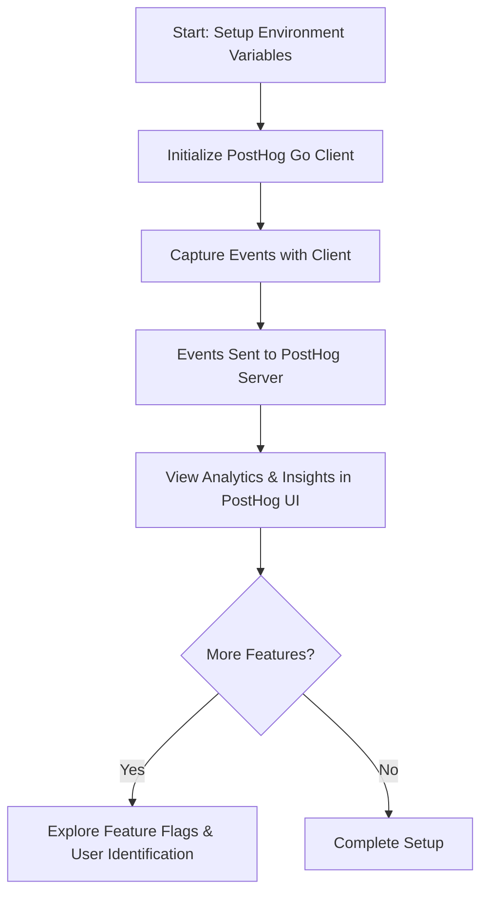

# Getting Started: Quickstart & Example Workflows

Unlock the power of PostHog Go with a streamlined guide that takes you from installation to capturing your first meaningful events. This page walks you through the essential setup steps, environment configuration, and real-world code examples to help you integrate analytics seamlessly into your Go applications.

---

## Why This Matters

Getting started with analytics can feel overwhelming, especially when you need quick feedback on user interactions and feature effectiveness. Our Quickstart & Example Workflows page is designed to remove friction and get your PostHog Go client up and running effortlessly. From setting up credentials to sending your first events, this guide ensures you focus on what matters: gaining insights to drive your product forward.

---

## What You Will Achieve Here

- Install and configure PostHog Go in your environment
- Understand the key environment variables to use
- Capture events using real Go code examples
- Explore example projects to experiment and expand your understanding

---

## Prerequisites

Before diving into the examples and setup, make sure you have:

- A PostHog project with an API key (found in your PostHog setup page)
- Go programming environment ready to run your applications
- Optional but recommended: a feature flag setup for the included examples

---

## Step 1: Environment Setup

Create your `.env` file by copying the provided template and inserting your API keys and endpoint information:

```bash
cp examples/.env.example .env
```

Edit `.env` to add your actual credentials:

```bash
POSTHOG_PROJECT_API_KEY=phc_your_project_api_key_here
POSTHOG_PERSONAL_API_KEY=phx_your_personal_api_key_here
POSTHOG_ENDPOINT=http://localhost:8000  # Adjust if not using posthog.com
```

> Environment variables set directly in your shell will override values in `.env`.

---

## Step 2: Running the Examples

The examples demonstrate essential PostHog Go functionalities including:

- Feature flags evaluation
- Event capture
- Advanced capture with feature flag options

### Option 1: Using the .env file (Recommended)

```bash
# With your .env set up, run all examples:
go run *.go
```

### Option 2: Using Environment Variables

```bash
export POSTHOG_PROJECT_API_KEY="your-project-api-key"
export POSTHOG_PERSONAL_API_KEY="your-personal-api-key"
export POSTHOG_ENDPOINT="https://app.posthog.com"

# Run all examples:
go run *.go
```

This will execute all the example files in the directory, giving you hands-on experience with the PostHog Go client.

---

## Step 3: Capture Your First Event

Here is a simple example that captures a "Download" event with key properties.

```go
package main

import (
    "github.com/PostHog/posthog-go"
    "log"
)

func main() {
    client, err := posthog.New("phc_your_project_api_key_here", nil)
    if err != nil {
        log.Fatalf("Failed to create client: %v", err)
    }
    defer client.Close()

    props := posthog.NewProperties()
    props.Set("application", "PostHog Go")
    props.Set("platform", "macos")
    props.Set("version", "1.0.0")

    err = client.Capture(posthog.Capture{
        DistinctId: "123456",
        Event:      "Download",
        Properties: props,
        Timestamp:  nil,
    })
    if err != nil {
        log.Fatalf("Event capture failed: %v", err)
    }

    log.Println("Event captured successfully")
}
```

This snippet sends an event labeled "Download" from a user identified by "123456". You can expand this with additional properties or customized context.

---

## Best Practices & Tips

- Always keep your API keys secure. Avoid committing them to source control.
- Use the `.env` file or environment variables to manage credentials and endpoint URLs cleanly.
- Explore the examples folder fully as it covers feature flags and error capture, extending your analytics capabilities.
- Use distinct user identifiers to ensure accurate event tracking and user analytics.
- Enable feature flags in your PostHog instance before running related examples to prevent unexpected errors.

---

## Troubleshooting Common Issues

<AccordionGroup title="Common Setup Problems and Solutions">
<Accordion title="Environment Variables Not Loaded">
Ensure the `.env` file is in the same directory you run your code from or set variables directly in your shell session. Use tools like `godotenv` for automatic loading in development.
</Accordion>
<Accordion title="Invalid API Key Errors">
Double-check your PostHog project API key correctness and usage. Project keys usually start with `phc_`. Personal keys start with `phx_` and are used for advanced features.
</Accordion>
<Accordion title="No Events Showing Up in PostHog">
Verify network connectivity and endpoint URL. Check logs for client errors. Make sure timestamps and event formats match expected schemas.
</Accordion>
</AccordionGroup>

---

## What’s Next?

Once you’ve run these examples and captured basic events, expand your usage by:

- Exploring feature flags workflows to dynamically control app features
- Learning how to identify users and alias them for unified analytics
- Diving into error capture and logging integration with the client

For these, see the guides under **Core Workflows** and **Advanced Use Cases** sections in the documentation navigation.

---

## Summary Diagram of the Quickstart Workflow



This simple flow illustrates the initial user journey through environment setup, event capturing, and onward to full-feature utilization.

---

For deeper exploration, please visit the related documentation pages for further configuration and troubleshooting assistance.


---

*End of Quickstart & Example Workflows Guide*


---